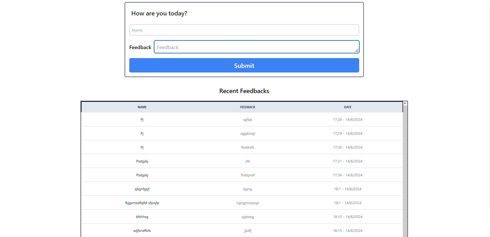

# Feedback App

## How to run this on a local machine?

1. Clone the repository: `git clone https://github.com/MrPurushotam/feedback-app.git`

2. Open 2 terminals - one for the backend and another for the frontend.
3. In one terminal, run the following commands:
- `cd backend`
- `npm install`
- `npm run dev`

4. In the other terminal, run the following commands:
- `cd frontend`
- `npm install`
- `npm run dev`

That's it!

Screenshot 

